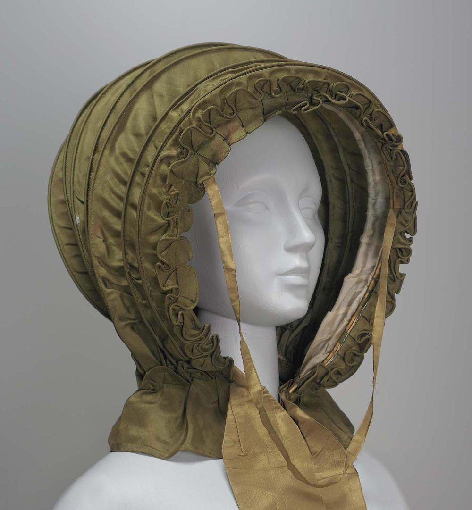

#cranford #episode-notes #craftlit #shownotes 
# Podcast Literature Note: CRANFORD chapter 4

**Recording Date:** 2025-04-07
## Book
CRANFORD chapter 4 
Ep 682 GREAT SCOTT!

**==OH MY GOD I HAVE LIPSTICK ON MY TEETH!** **Can you cover me entirely** when I mentions the three premium options by showing screenshots of those sites? I put the screenshots into the 682 dropbox. 
**ALSO at 1:18** I say thank you/we couldn't do this without you, but I repeat that again after the names. Please cut the 1:18 version==
## Patrons
**For ep. 682:**  
• Judi Serrato  
• Larry  
• Jean Greaves  
• Karen LePage  
• Robert

## Raffle Item
**==1:56 - PLS SHOW THE THUMBNAIL OF THE Emma LIVESTREAM --I THINK IT HAS BECCA'S URL ON IT (OR BLOG TITLE)==**
MAY RAFFLE - Sir Walter Scott Cross stitch from Rebecca S (Of Book it with Becca, who wrote the wonderful post: ["What do you do with a problem like Emma?"](https://bookitwithbecca.wordpress.com/?s=emma) 
**==Val should have Raffle link==**
==2:20 can you put some/all of the pics I saved in the 482 folder for you from our visit to Sir Walter Scott's house ==
**from 02:42 all the way to 3:34 - PLEASE put a black box over the screen and roll the crossstitch video--in Slack message with you with dimensions** - the dimensions to put on screen and in shownotes are: 9"x11" (23cmx30cm) I also shared two good still pics of the cross stitch into the social-media channel in Slack

+Plum Deluxe use this code onscreen and in shownotes: https://bit.ly/craftlit-pdtea
## Crafty Chat Notes
- 03:55 - [Gardening Olla DIY video 1](https://youtu.be/Wz-jj170EYw?si=eGnaG7zrsfoqeDMu) and [a plastic bottle version](https://youtube.com/shorts/WXiey-SYp_0?si=s29pOgoCct-U2WMg)
	- and  [gardening video with fake drip irrigation](https://youtube.com/shorts/q8Tqv1R5lnU?si=xAr5XTkDvWW76K08)
- 06:12 [SEND US YOUR CRAFTY VIDEOS](https://bit.ly/craftlit-be-crafty) 

## Re-hash Notes
- 07:18 - Thin Man Movie Watch Party, MAY 24, 2025 ==please put date on screen (or even better, cover screen with your awesome thumbnail for 5sec or so)  If you need to level-up to join us [we've made it easy](https://craftlit.gumroad.com/l/craftlit-party)! Oh, andPLEASE ADD MYRNA LOY wrinkled nose pic at the 9 min mark - **it's in dropbox**
- ==09:47 - please put the **level up URL** on the screen
- 09:54 - Re- hash ***Chapter 3: A Love Affair of Long Ago*** - Miss Matty Jenkyns reminisces about her past romance with Mr. Holbrook, which was thwarted by her family’s disapproval. 
	- Miss J couldn't SUCK an orange (then by ch 3 she was gone from us) 
	- Martha, the new girl of all work trying to learn how to do her job and nudging Major Jenkyns when he didn't serve himself fast enough
## Pre-hash Notes***Chapter 4: A Visit to an Old Bachelor***
- 11:00 Miss Matilda SATE bolt upright (not a typo)
- 11:16 Poetry today from George Herbert—selections from will be featured at the end of the episodes, Euan Bartlett is the reader
- 12:00 "Pudding before meat" and “no broth no ball; no ball, no beef” 
- ==Erik, here are some pics to cover me with (b/c I look bored when really I'm trying to figure out if playing it off my phone was stupid or not)
- **Suet Pudding:**
![[13.06min-Suet-Pudding-7-scaled.jpg]]

- **Spotted Dick pudding:**
- 

**Steak and Kidney pudding:**


**Yorkshire Pudding**

- 14:00 [Yorkshire Pudding, a Humble History](https://www.realyorkshireblog.com/post/the-yorkshire-pudding-a-humble-history)
- 15:32 Old fashioned forks - like 16th Century/1500s - were two-tine forks.


- 16:44 *“Aminé at her grains of rice after her previous feast with the Ghoul”* - from "The Story of Sidi-Nouman" from One Thousand and One Nights (1765-8) Aminé is wife of Sidi Nouman who notices she only eats rice with a bodkin. He figures out she’s a Ghoul who goes to cemeteries at night to feast on the newly-buried dead so rice was pretty ‘meh’ for her. **EMBED CODE TO STORY 
```
<iframe src="https://archive.org/embed/arabiannightsent00rich" width="560" height="384" frameborder="0" webkitallowfullscreen="true" mozallowfullscreen="true" allowfullscreen></iframe>
```
And embed code for wordpress.com blogs (?!)
```
[archiveorg arabiannightsent00rich width=560 height=384 frameborder=0 webkitallowfullscreen=true mozallowfullscreen=true]
```
- and PIC from old edition FOR VIDEO & shownotes
 **

- 17:48 “Unbecoming [***calashes***](https://collections.mfa.org/objects/116425) to put on over their caps” - threw me b/c of the Caleche’s in Dracula - turns out they’re related! Retractable hood to put over a cap! **PICTURE TO SHARE on VIDEO & in shownotes 

18:08 PUT PIC OF CALESH carraige UP ON VIDEO 


- 19:34  Tennyson  - a line about cedars from 1842’s [“The Gardiner’s Daughter”](https://www.telelib.com/authors/T/TennysonAlfred/verse/englishidyls/gardenersdaughter.html) and in the original text It’s missing from the published version so a conversation turn would have been less of an utter non-sequiter in the OG version. ==**IF POSSIBLE PUT ashbuds TEXT from cranford ON VIDEO SCREEN - don't bother with shownotes**==
- 20:30 Headsup for the crocheters in our midst.
- 20:48 [“Locksley Hall” by Tennyson](https://www.poetryfoundation.org/poems/45362/locksley-hall) - not included accidentally. 
- 21:04 Visiting rules - more
## Post-chapter Notes
- 49:40 '*“My cousin might make a drive, I think,” said Miss Pole, who was afraid of ear-ache, and had only her cap on.* '— spectacular set of non-sequiters (p41)
- 53:30 I saw, I imitated, I survived - Mary Smith as Cæsar - using rounded knife tip as a spoon-ish food delivery device
- Don't forget!  [SEND US YOUR CRAFTY VIDEOS](https://bit.ly/craftlit-be-crafty) 
 
## Poem selections
George Herbert’s poetry often draws on the natural world, gardens, and quiet reflection:
1. “The Flower”

Theme: Renewal, the seasons of the soul, joy in growth
Perfect for July because: It celebrates the resurgence of beauty and hope—after cold or darkness, flowers bloom again.

	“Grief melts away
Like snow in May,
As if there were no such cold thing.”

	“Who would have thought my shriveled heart
Could have recovered greenness? It was gone
Quite underground; as flowers depart
To see their mother-root, when they have blown.”

	“Thy garden is not bare;
And I shall find once more
The sweet communion with thy saints.”

2. “Easter”

Yes, it’s tied to the holiday, but it also celebrates light and blooming.

	“Rise heart; thy Lord is risen. Sing his praise
Without delays,
Who takes thee by the hand, that thou likewise
With him mayst rise.”

Pair this with literal rising things—morning sun, lilies, tall foxgloves.

3. “The Pulley”

Theme: Why God withholds perfect rest—so we seek Him.
This works well in summer, when life feels abundant, but still leaves a twinge of longing.

	“When God at first made man,
Having a glass of blessings standing by…”
(and yet withheld rest, to draw man’s soul back to God)

A beautiful idea for a reflective pause among too-perfect blooms.

4. “Love (III)”

Theme: Divine love, human unworthiness, and acceptance
It’s more theological, but gentle and moving—great for a quiet bench moment in a shady corner.

	“Love bade me welcome; yet my soul drew back…”
“You must sit down,” says Love, “and taste my meat.”
So I did sit and eat.”

It pairs beautifully with the hum of bees and the hospitality of a garden.

If you want a very short quote for your garden journal or bench-musing:
	•	“Thou hast given me this herb of grace to smell and taste.” — from “Grace”
	•	“Sweet rose, whose hue angry and brave…” — from “Virtue”
	•	“He that in mirth and youthful jollity keeps measure, is more temperate than he that lets his sorrow flow out without check.” — from his prose The Country Parson  